# Jenkins pipeline that builds your docker image, pushes it to Container Registry and pulls and runs it in EC2.

## CI/CD Pipeline Documentation: CRUD Web App with PostgreSQL

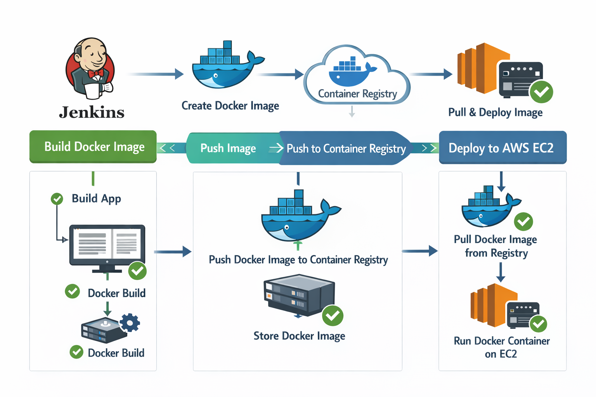

## Project Overview

This project demonstrates a complete CI/CD pipeline for deploying a FastAPI CRUD web application with PostgreSQL database using Jenkins, Docker, and AWS EC2. The pipeline automates the process of building Docker images, pushing to Docker Hub, and deploying to an EC2 instance.

## Table of Contents

- [Architecture](#architecture)
- [Prerequisites](#prerequisites)
- [Project Structure](#project-structure)
- [Infrastructure Setup](#infrastructure-setup)
- [Jenkins Configuration](#jenkins-configuration)
- [Pipeline Execution](#pipeline-execution)
- [Accessing the Application](#accessing-the-application)
- [Troubleshooting](#troubleshooting)

## Architecture

The deployment architecture consists of:

- **Application**: FastAPI web application with CRUD operations
- **Database**: PostgreSQL 15
- **Container Registry**: Docker Hub
- **CI/CD**: Jenkins Pipeline
- **Infrastructure**: AWS EC2 instance provisioned with Terraform
- **Orchestration**: Docker Compose

## Prerequisites

### Local Development Environment
- WSL (Windows Subsystem for Linux) or Linux/Mac
- Docker and Docker Compose installed
- Git
- Terraform (for infrastructure provisioning)
- Jenkins running on `localhost:8080`

### Cloud Services
- AWS Account with EC2 access
- Docker Hub account

### Required Credentials
- GitHub Personal Access Token
- Docker Hub credentials
- AWS EC2 SSH key pair

## Project Structure

```
.
├── .env/
│   └── dev_env                 # Environment variables
├── app/
│   ├── static/
│   │   └── style.css          # Stylesheet
│   ├── templates/
│   │   ├── base.html          # Base template
│   │   ├── create.html        # Create record page
│   │   ├── edit.html          # Edit record page
│   │   └── index.html         # Main page
│   ├── crud.py                # CRUD operations
│   ├── database.py            # Database configuration
│   ├── main.py                # FastAPI application entry
│   ├── models.py              # SQLAlchemy models
│   └── schemas.py             # Pydantic schemas
├── .gitignore
├── docker-compose.yaml        # Docker Compose configuration
├── Dockerfile                 # Application container definition
├── requirements.txt           # Python dependencies
└── deploy.groovy             # Jenkins pipeline script
```

## Infrastructure Setup

### Step 1: Provision EC2 Instance with Terraform

Create a `user_data.sh` script to bootstrap the EC2 instance:

```bash
#!/bin/bash
set -euxo pipefail
export DEBIAN_FRONTEND=noninteractive

# Update system
apt-get update -y

# Install required packages
apt-get install -y \
  ca-certificates \
  curl \
  gnupg \
  lsb-release \
  software-properties-common

# Create keyring directory
mkdir -p /etc/apt/keyrings

# Add Docker GPG key
curl -fsSL https://download.docker.com/linux/ubuntu/gpg \
  | gpg --dearmor -o /etc/apt/keyrings/docker.gpg

# Add Docker repository
echo \
  "deb [arch=$(dpkg --print-architecture) signed-by=/etc/apt/keyrings/docker.gpg] \
  https://download.docker.com/linux/ubuntu \
  $(lsb_release -cs) stable" \
  | tee /etc/apt/sources.list.d/docker.list > /dev/null

# Install Docker
apt-get update -y
apt-get install -y docker-ce docker-ce-cli containerd.io

# Enable and start Docker
systemctl enable docker
systemctl start docker

# Add ubuntu user to docker group
usermod -aG docker ubuntu

# Verify Docker installation
docker --version
```

This script:
- Updates the system packages
- Installs Docker and its dependencies
- Configures Docker to start on boot
- Adds the `ubuntu` user to the docker group for non-root access

### Step 2: Initial EC2 Configuration

After the EC2 instance is provisioned, perform a **one-time manual setup**:

1. SSH into the EC2 instance:
```bash
ssh -i /path/to/your-key.pem ubuntu@<EC2_PUBLIC_IP>
```

2. Create the environment directory:
```bash
mkdir -p ~/.env
```

3. From your local machine, copy the environment file:
```bash
scp -i /path/to/your-key.pem .env/dev_env ubuntu@<EC2_PUBLIC_IP>:~/.env/
```

**Note**: This step only needs to be done once during initial setup.

## Environment Configuration

### `.env/dev_env` File Contents

```bash
# Application Image
APP_IMAGE=pujan240/crud_app:latest

# Database Image
DATABASE_IMAGE=postgres:15

# PostgreSQL Environment Variables
POSTGRES_USER=admin
POSTGRES_PASSWORD=admin123
POSTGRES_DB=crud_db
```

These variables are:
- Used by Docker Compose to configure containers
- Passed to `database.py` for database connection
- Referenced in the `docker-compose.yaml` file

### `docker-compose.yaml`

```yaml
version: "3.9"

services:
  db:
    image: ${DATABASE_IMAGE}
    env_file: 
      - ./.env/dev_env
    container_name: fastapi-db
    environment:
      POSTGRES_USER: ${POSTGRES_USER}
      POSTGRES_PASSWORD: ${POSTGRES_PASSWORD}
      POSTGRES_DB: ${POSTGRES_DB}
    volumes:
      - postgres_data:/var/lib/postgresql/data

  app:
    image: ${APP_IMAGE}
    env_file: 
      - ./.env/dev_env
    container_name: fastapi-app
    ports:
      - "80:8000"
    depends_on:
      - db
    environment:
      POSTGRES_USER: ${POSTGRES_USER}
      POSTGRES_PASSWORD: ${POSTGRES_PASSWORD}
      POSTGRES_DB: ${POSTGRES_DB}

volumes:
  postgres_data:
```

### `Dockerfile`

```dockerfile
FROM python:3.11-slim
WORKDIR /app
COPY requirements.txt .
RUN pip install --no-cache-dir -r requirements.txt
COPY . .
CMD ["uvicorn", "app.main:app", "--host", "0.0.0.0", "--port", "8000"]
```

## Jenkins Configuration

### Step 1: Access Jenkins

1. Ensure Jenkins is running on your local machine
2. Open browser and navigate to `http://localhost:8080`

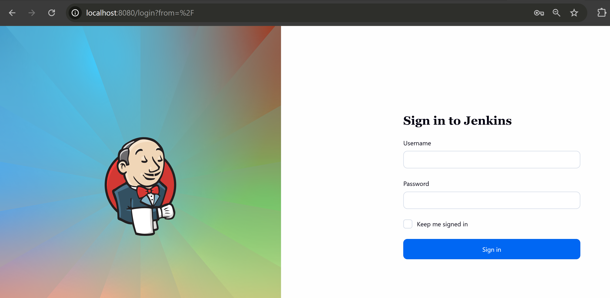

### Step 2: Create Jenkins Pipeline

1. Click **+ New Item** from the Jenkins dashboard
2. Enter item name: `Docker-EC2`
3. Select **Pipeline** as the project type
4. Click **OK**

Build Item
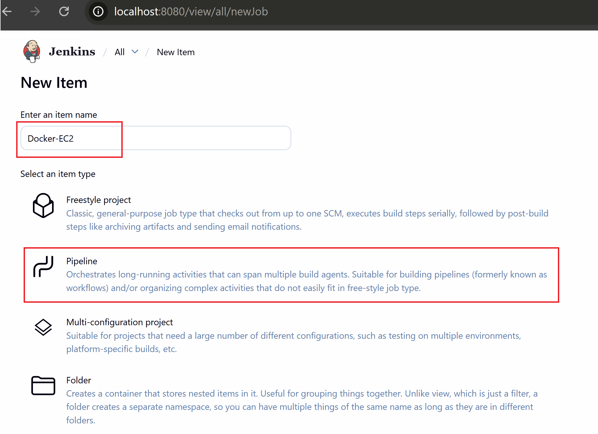

### Step 3: Configure Pipeline Parameters

In the configuration page:

1. **Check** "This project is parameterized"
2. Click **Add Parameter** → **String Parameter**
3. Configure:
   - **Name**: `SERVER_IP`
   - **Description**: "Enter the Server Public IP"

Parameters:
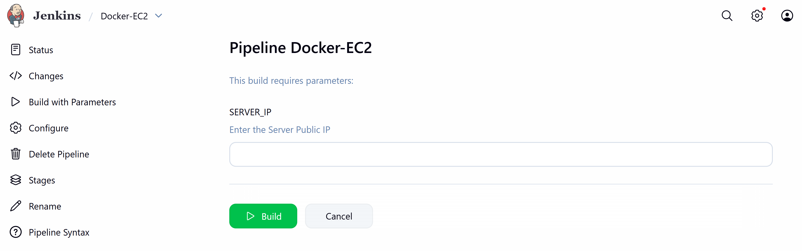


### Step 4: Configure Pipeline Script Source

1. Under **Pipeline** section:
   - **Definition**: Select "Pipeline script from SCM"
   - **SCM**: Select "Git"
   - **Repository URL**: `https://github.com/Pujanstha1/ci-cd-jenkins-docker-aws.git`
   - **Branch Specifier**: `*/main`
   - **Script Path**: `deploy.groovy`

2. Click **Save**

Configure
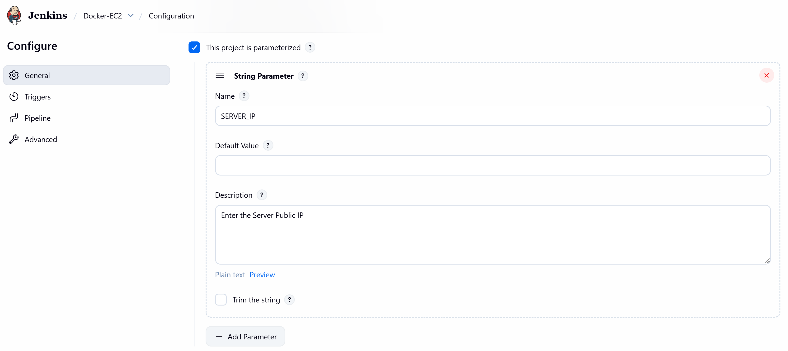
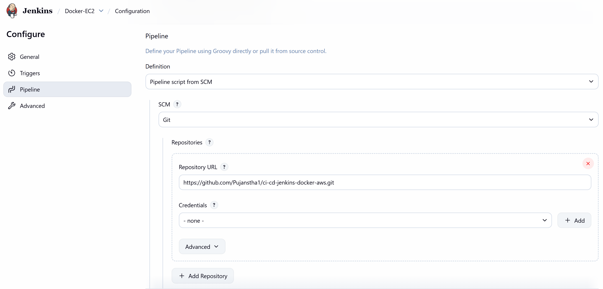
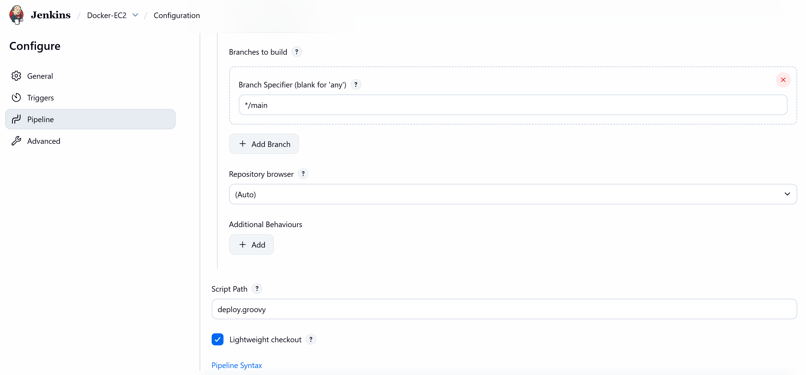

### Step 5: Configure Credentials

Navigate to **Manage Jenkins** → **Credentials** → **System** → **Global credentials**

#### Add GitHub Personal Access Token

1. Click **Add Credentials**
2. **Kind**: Secret text
3. **Secret**: Your GitHub Personal Access Token
4. **ID**: `GITHUB_TOKEN` (or as referenced in your pipeline)
5. **Description**: "GitHub PAT for repository access"
6. Click **Create**

#### Add Docker Hub Password

1. Click **Add Credentials**
2. **Kind**: Secret text
3. **Secret**: Your Docker Hub password or access token
4. **ID**: `DOCKER_HUB_PASSWORD`
5. **Description**: "Docker Hub credentials"
6. Click **Create**

#### Add EC2 SSH Key

1. Click **Add Credentials**
2. **Kind**: Secret file
3. **File**: Upload your EC2 private key (.pem file)
4. **ID**: `SSH_KEY_FILE`
5. **Description**: "EC2 SSH private key"
6. Click **Create**

Credentials:
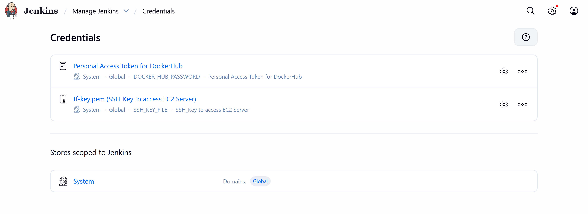


## Pipeline Execution

### Understanding the Pipeline

The `deploy.groovy` pipeline consists of two main stages:

#### Stage 1: Build and Push Docker Image

```groovy
stage ('Build an Image and Push it to DockerHub') {
    steps {
        withCredentials([
            string(credentialsId: "DOCKER_HUB_PASSWORD", variable: "DOCKER_HUB_PASSWORD")
        ]) {
            sh '''
                set -e
                echo "$DOCKER_HUB_PASSWORD" | docker login -u $DOCKER_HUB_USER --password-stdin
                docker build -t "$DOCKER_HUB_USER/$DOCKER_HUB_REPO:$TAG" .
                docker push "$DOCKER_HUB_USER/$DOCKER_HUB_REPO:$TAG"
            '''
        }
    }
}
```

This stage:
- Logs into Docker Hub using credentials
- Builds the Docker image from the Dockerfile
- Tags the image as `pujan240/crud_app:latest`
- Pushes the image to Docker Hub

#### Stage 2: Deploy to EC2

```groovy
stage ('Deploy to EC2') {
    steps {
        withCredentials([
            file(credentialsId: "SSH_KEY_FILE", variable:"SSH_KEY")
        ]) {
            sh '''
                set -e
                mkdir -p ~/.ssh
                chmod 700 ~/.ssh
                rm -f ~/.ssh/config
                touch ~/.ssh/known_hosts 
                ssh-keygen -R "$SERVER_IP"
                scp -i "$SSH_KEY" \
                    -o StrictHostKeyChecking=no \
                    docker-compose.yaml \
                    "$SERVER_USER@$SERVER_IP:~/"
                ssh -i "$SSH_KEY" \
                    -o StrictHostKeyChecking=no \
                    $SERVER_USER@$SERVER_IP " 
                        docker compose --env-file ./.env/dev_env pull 
                        docker compose --env-file ./.env/dev_env down 
                        docker compose --env-file ./.env/dev_env up -d 
                    "
            '''
        }
    }
}
```

This stage:
- Configures SSH settings
- Copies `docker-compose.yaml` to EC2 instance
- Connects to EC2 via SSH
- Pulls the latest Docker image
- Stops existing containers
- Starts new containers with the updated image

### Running the Pipeline

1. **Push code to GitHub**:
```bash
git add .
git commit -m "Your commit message"
git push origin main
```

2. **Navigate to Jenkins**:
   - Go to `http://localhost:8080`
   - Click on **Docker-EC2** from the dashboard

Dashboard 
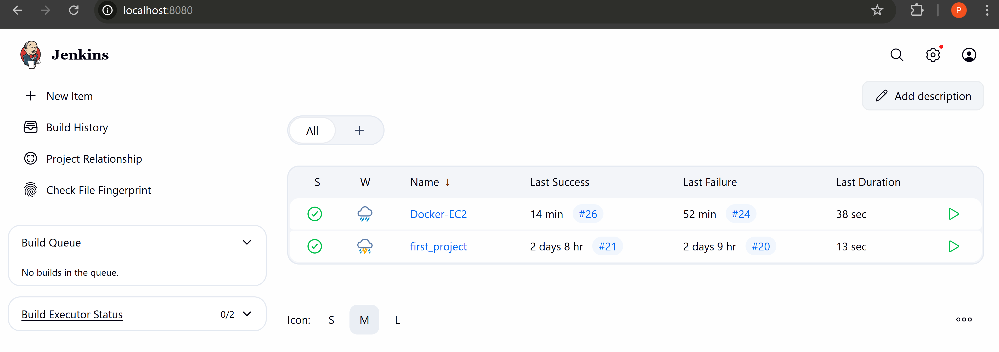

3. **Build with Parameters**:
   - Click **Build with Parameters** on the left sidebar
   - Enter your EC2 instance's **Public IP** in the `SERVER_IP` field
   - Click **Build**

**Note**: Since we're not using Elastic IP, the EC2 public IP changes on instance restart. Always check and enter the current public IP before building.

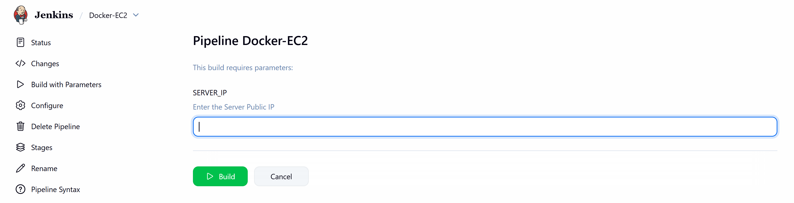


### Monitoring the Build

1. **View Build Progress**:
   - Click on the build number (e.g., #1, #2) under "Build History"
   - Click **Console Output** to see real-time logs

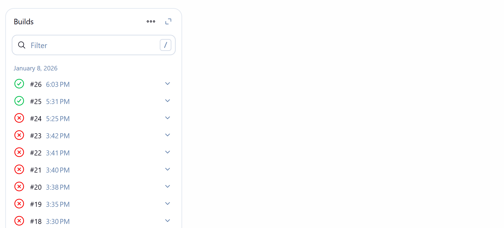

2. **Console Output shows**:
   - Git repository cloning
   - Docker image build process
   - Docker Hub push progress
   - SSH connection to EC2
   - Docker Compose commands execution
   - Success or failure status


Console Output
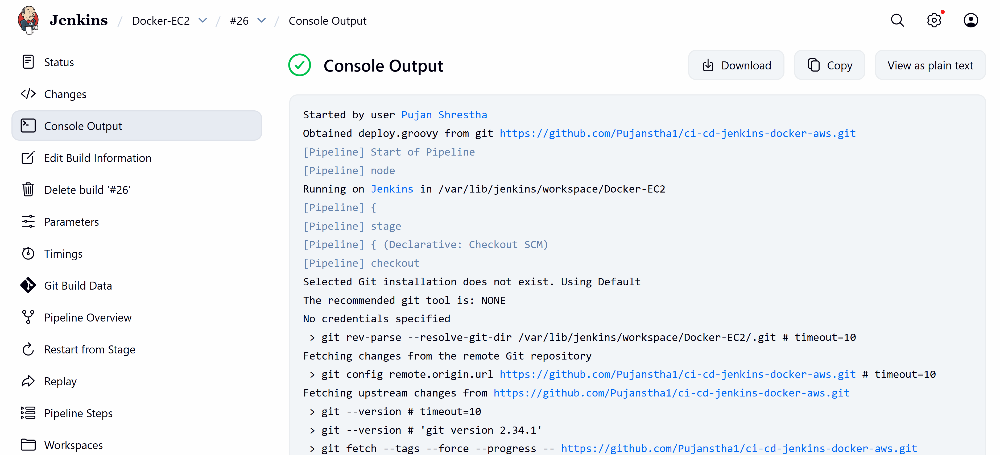

3. **Build Status Indicators**:
   - **Blue/Green ball**: Success
   - **Red ball**: Failure
   - **Yellow ball**: Unstable

Status
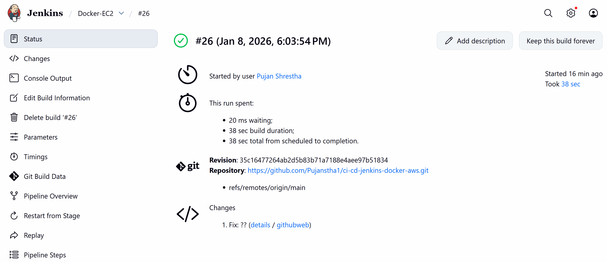

## Accessing the Application

After successful deployment:

1. Open your web browser
2. Navigate to: `http://<EC2_PUBLIC_IP>`
3. The CRUD application should be accessible

The application runs on:
- **External Port**: 80 (HTTP)
- **Internal Port**: 8000 (FastAPI/Uvicorn)

Final Output
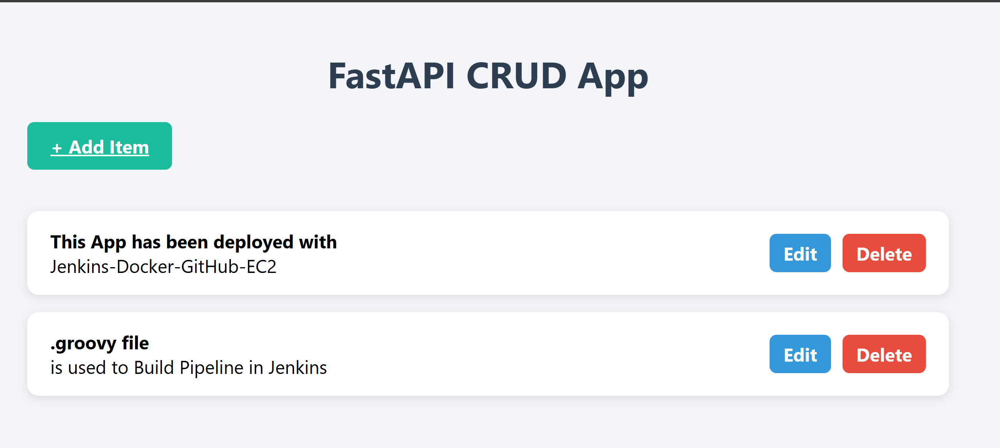

## Troubleshooting

### Common Issues and Solutions

#### 1. SSH Connection Failed

**Error**: `Permission denied (publickey)`

**Solution**:
- Verify SSH key is correctly uploaded to Jenkins credentials
- Check EC2 security group allows SSH (port 22) from Jenkins server
- Ensure the key file has correct permissions (400)

#### 2. Docker Login Failed

**Error**: `Error response from daemon: Get https://registry-1.docker.io/v2/: unauthorized`

**Solution**:
- Verify Docker Hub credentials in Jenkins
- Check if Docker Hub password/token is valid
- Ensure credentials ID matches the pipeline script

#### 3. Docker Compose File Not Found

**Error**: `docker-compose.yaml: No such file or directory`

**Solution**:
- Verify file exists in repository root
- Check SCP command completed successfully in Console Output
- Ensure file was copied to correct location on EC2

#### 4. Environment Variables Not Loading

**Error**: Database connection issues or container startup failures

**Solution**:
- Verify `.env/dev_env` exists at `~/.env/dev_env` on EC2
- Check file permissions: `chmod 644 ~/.env/dev_env`
- Ensure environment variable names match exactly

#### 5. Port Already in Use

**Error**: `Bind for 0.0.0.0:80 failed: port is already allocated`

**Solution**:
```bash
# SSH into EC2
ssh -i your-key.pem ubuntu@<EC2_IP>

# Stop existing containers
docker compose --env-file ./.env/dev_env down

# Clean up
docker system prune -f
```

#### 6. Application Not Accessible

**Checklist**:
- [ ] Verify EC2 security group allows inbound traffic on port 80
- [ ] Check containers are running: `docker ps`
- [ ] Verify logs: `docker logs fastapi-app`
- [ ] Ensure correct Public IP is being used

### Viewing Application Logs

SSH into EC2 and run:

```bash
# View app logs
docker logs fastapi-app

# View database logs
docker logs fastapi-db

# Follow logs in real-time
docker logs -f fastapi-app
```

### Restarting Services

If you need to manually restart:

```bash
# SSH into EC2
ssh -i your-key.pem ubuntu@<EC2_IP>

# Navigate to compose file location
cd ~

# Restart services
docker compose --env-file ./.env/dev_env restart

# Or rebuild and restart
docker compose --env-file ./.env/dev_env down
docker compose --env-file ./.env/dev_env pull
docker compose --env-file ./.env/dev_env up -d
```

## Pipeline Environment Variables

The pipeline uses the following environment variables:

```groovy
environment {
    SERVER_USER = 'ubuntu'              // EC2 username
    DOCKER_HUB_USER = 'pujan240'       // Docker Hub username
    DOCKER_HUB_REPO = 'crud_app'       // Docker Hub repository
    TAG = 'latest'                      // Image tag
}
```

Update these values according to your configuration.

## Security Best Practices

1. **Never commit sensitive data**:
   - Add `.env/` to `.gitignore`
   - Use Jenkins credentials for secrets
   - Rotate passwords regularly

2. **EC2 Security**:
   - Limit SSH access to specific IPs
   - Use security groups effectively
   - Keep instances updated

3. **Docker Hub**:
   - Use access tokens instead of passwords
   - Implement image scanning
   - Use private repositories for sensitive applications


